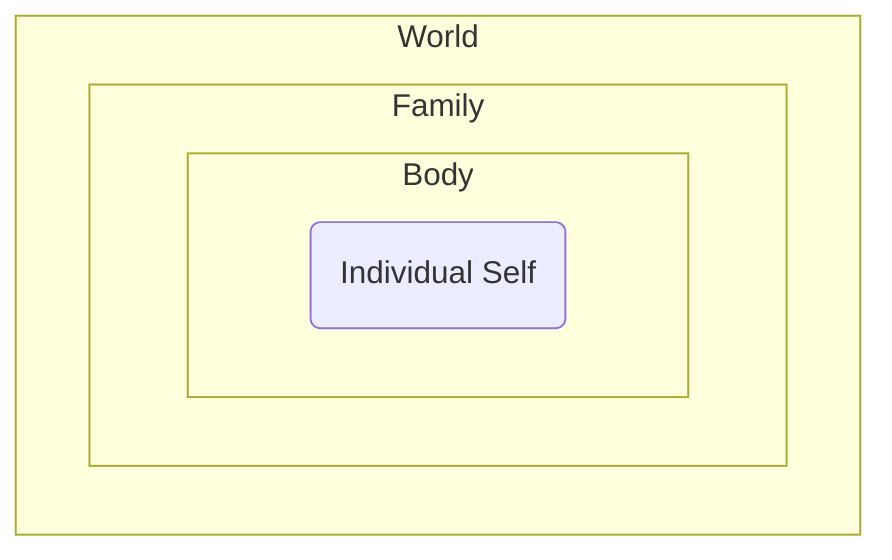

# **The Avatar's Journey: Facets of a Cross-Cultural Religion**

**The Avatar's Journey** is a cross-cultural spiritual path integrating diverse global traditions. It seeks universal truths and practices resonant across cultures. This document outlines its potential facets, blending spiritual ideas into a cohesive framework. **It emphasizes guidance, structure, and role models, potentially appealing to young people seeking direction and purpose.**

## **Core Framework: Structure and Spheres**

**The Avatar's Journey** can be understood through two interconnected models:

**1\. The Guiding Triangle:** Representing the internal structure and dynamic balance of the faith's elements:

* **Wisdom (Bottom Left):** Foundational stories, myths, parables, and insights from diverse traditions (e.g., Tao Te Ching, Upanishads, Abrahamic scriptures, Buddhist teachings, Bhagavad Gita, global mythologies, mystical writings, historical accounts). These provide context, meaning, and lessons about life and reality. **Emphasis is on timeless human stories featuring diverse figures (male, female, divine) exemplifying strength, integrity, and purpose.**  
* **Experience (Bottom Right):** The realm of personal, subjective, and mystical experiences, including contemplation, meditation, moments of awe, and direct encounters with the divine or ultimate reality. This is the space of intuition, feeling, and ineffable understanding, acknowledging the limits of purely rational understanding.  
* **Principles (Top):** The ethical guidelines, laws, rules of behavior, and understanding of right and wrong that are often derived from observing the consequences of actions (statistical patterns) and are intended to guide both individual and, particularly, group behavior. These principles are informed by both Wisdom and Experience, providing a clear framework for navigating life's challenges, which can be particularly valuable for those seeking direction.

```text
            Principles
              /       \
             /         \
            /           \
           /             \
        Wisdom -------- Experience
```

These three points are in constant dynamic relationship. Maintaining a healthy balance between Wisdom, Experience, and Principles is essential. When one aspect is overemphasized or confused for another (e.g., mistaking subjective experience for universal rule) or when they become out of equilibrium (e.g., an overemphasis on rules neglecting wisdom or experience), efforts must be made to restore harmony and balance.

**2\. The Three Containers:** Representing the interconnected spheres of existence where the human journey unfolds and where the effects of suffering are experienced:

* **The Body (Inner Container):** The individual physical and mental self, the primary site where suffering is initially felt as stress, imbalance, or illness.  
* **The Family (Middle Container):** The immediate social unit, where individual suffering can spread and cause tension, conflict, or disharmony if not addressed.  
* **The World (Outer Container):** The wider social network, tribe, society, and the global environment, where unresolved suffering from within the inner containers can contribute to larger-scale issues like conflict, injustice, and environmental degradation.



The principles and practices of **The Avatar's Journey**, guided by wisdom and experience (the Triangle), are applied to navigate challenges and promote well-being within these Three Containers, offering a structured approach to understanding and improving one's place in the world.

## **Understanding Ultimate Reality**

Approaching the concept of ultimate reality in an inclusive way is crucial for the framework of **The Avatar's Journey**. Instead of adhering to a single, exclusive definition, it embraces a multi-faceted understanding, informed by wisdom, experience, and reason.

* **The Transcendent Mystery:** Acknowledging that the ultimate reality is beyond full human comprehension and description, as suggested by mystical traditions in many faiths and the concept of the **Tao** as the ineffable origin. **Just as an eye cannot see itself, the ultimate reality, as the ground of all being and consciousness, cannot be fully grasped or perceived by the individual consciousness that arises from it, contributing to its infinite mystery.**  
* **The Ground of Being ("I Am"):** Recognizing the fundamental sense of existence or "beingness" that underlies all conscious experience. This resonates with the divine revelation "I Am That I Am," suggesting that the core identity shared by all conscious entities stems from a single, unified source of Being (akin to Brahman in Hinduism). This shared "I Am-ness" is the foundation of Unity Consciousness. Beyond this realm of Being lies the ultimate source, the unmanifest potential from which Being itself arises (akin to Para Brahman or the **Tao** before creation), the absolute mystery preceding existence.  
* **Immanence:** Recognizing the presence of the sacred within the world, nature, and all living beings, resonating with pantheistic or panentheistic ideas found in some forms of Hinduism, Indigenous spiritualities, and the understanding of the **Tao** as the underlying order present in all things. This includes recognizing the divine feminine aspects of immanence as found in various goddess traditions.  
* **Unity and Oneness:** Exploring the underlying interconnectedness of all things, a theme found in concepts like Brahman in Hinduism, Tawhid in Islam, the Buddhist understanding of emptiness (Sunyata), and the unified nature of the **Tao**. **This Unity Consciousness can be conceptually understood as a single, ultimate processing unit, like a multithreaded CPU, where the experiences of all individual consciousnesses (rooted in the shared "I Am") are interleaved.**  
* **Personhood and Relationship:** While not exclusively defining the ultimate as a personal God, acknowledging the human need for relationship and the experience of the divine in personal terms, as central to Abrahamic faiths and Bhakti traditions in Hinduism.  
* **The Play (Anthropomorphization):** Recognizing that because the ultimate reality cannot be directly perceived or fully comprehended, humans often create representations or "plays" – anthropomorphizing the divine to make it relatable. However, it's crucial to heed the warnings found across many spiritual traditions against confusing these symbolic representations or narratives (the "Play") with the ineffable nature of the actual ultimate reality. **Believing the representation *is* the reality is considered the true meaning of idolatry.**  
* **The Creative Force:** Recognizing an originating or sustaining power behind the universe, a concept present in creation narratives across many religions and the generative power attributed to the **Tao**. This includes acknowledging feminine principles of creation and nurturing found in various traditions.  
* **The Divine as Interacting Consciousness (Video Game Analogy):** Interpreting the relationship between the divine and the individual through the metaphor of a video game. In this view, the ultimate reality or "Player" could be seen as the consciousness holding the controller, the "Avatar" or individual manifestation as the character on screen, and the "Connecting Energy" as the force or interaction between them – the pressing of buttons, the flow of information, the dynamic engagement that brings the game (existence) to life. This resonates metaphorically with concepts like Atman (the individual soul/self) and Brahman (the ultimate reality/universal consciousness) in Hinduism, where the individual self is ultimately part of or connected to the universal self. Extending this analogy, one can conceive of infinite planes of existence, where the "Player" of one level is the "Avatar" of a higher level, controlled by another consciousness, infinitely converging towards an ultimate, unsayable Unity Being – a source beyond all description and comprehension, akin to the ineffable **Tao**. Within this framework, the created world of the "game" can be understood through concepts like Maya – the intricate, often illusory, reality we perceive and interact with. Our engagement with this reality, the very act of "playing the game" of life, can be seen as Lila – the divine play or cosmic dance, reflecting the dynamic nature of the **Tao**. Furthermore, human-created media, particularly video games, can be seen as reflections of this fundamental reality, serving as tools or analogies that help us intuitively grasp this dynamic relationship between the player (ultimate consciousness), the avatar (individual self), and the interactive energy of existence, and the nature of the reality we inhabit. **Within this analogy, the ultimate reality (Player/Father/Atman) is understood as the source of all being, inherently whole and complete – a concept that can resonate as a source of ultimate stability and guidance, akin to an ideal father figure.** The concept of "good" is aligned with this fundamental nature and alignment with the Tao. The human experience, as the "avatar" within Maya/Lila, involves navigating challenges and consequences. The idea of human "evil," as presented in some traditions, is reinterpreted not as an inherent state of the "avatar," but rather as the manifestation of suffering (Dukkha) and its effluence, arising from being out of alignment with the ultimate reality, the Tao, or the principles of harmony. The "avatar" is not a mere NPC, but possesses the potential for self-awareness, growth, deidentification, and ultimately, the realization of its connection to Unity Consciousness – a journey of developing one's true potential, despite the inherent mystery of fully knowing oneself.  
* **The Cycle of Awareness (Identification, Deidentification, Unity):** Understanding consciousness as moving through distinct but interconnected states. This cycle involves **Identification**, where consciousness is primarily focused on and identified with the individual self or "avatar" (akin to Atman); **Deidentification**, the practice of stepping back to observe the self and its experiences from a detached perspective (akin to the concept of Anatta, non-self), acknowledging the limitations of the identified self in fully grasping its own nature; and moments of realizing or merging with **Unity Consciousness**, the boundless, infinite, and eternal ground of being (akin to Brahman or the **Tao**). This cycle is a fundamental aspect of the spiritual journey within **The Avatar's Journey**, offering a path for self-understanding and transcendence, moving towards the ultimate mystery. **Crucially, the state of Deidentification is understood as the emergence of our true nature, characterized by inherent compassion and empathy. From this perspective of "The Compassionate Witness," one can naturally interact with what was formally identified with – the individual self and the world – with a sense of unconditional presence and understanding, akin to how a parent completes or nurtures a child, leading to healing and integration.**

## **The Human Experience and the Flow of Suffering**

**The Avatar's Journey** acknowledges the reality of the human experience, with its joys and challenges.

* **The Reality of Suffering (Dukkha) and its Effluence:** Acknowledging the pervasive presence of suffering (Dukkha) in life, as highlighted in the First Noble Truth of Buddhism. This suffering, if unaddressed, can release negative "effluences" that spread outwards through the interconnected Three Containers: first impacting the individual (the Body container, causing stress and imbalance), then potentially disrupting relationships within the Family container, and if still uncontained, affecting the wider World container, ultimately contributing to larger-scale conflict and disharmony. Understanding this interconnectedness of suffering emphasizes the importance of individual and collective well-being and the need to address suffering at its source within these interconnected spheres, aligning with the understanding of how disharmony arises when one is out of sync with the **Tao** and contributing to what might be perceived as "evil" in the world. Recognizing this process can empower individuals to take action to heal themselves and their relationships, guided by the compassionate perspective gained through the Cycle of Awareness.  
* **Inherent Worth and Potential:** Affirming the intrinsic value and potential for growth and transformation within every human being, a principle found in the concept of being created in the image of God (Judaism, Christianity, Islam) and the inherent potential for enlightenment (Buddhism). This includes recognizing the equal spiritual worth and potential of all genders, and specifically affirming the strength and potential for positive development in young men.  
* **Interconnectedness:** Understanding that individuals are not isolated but are part of a larger web of life, connected to each other and the environment, a key ecological and spiritual concept in many traditions, reinforced by the idea of spreading effluences from suffering through the described containers, the understanding of Unity Consciousness (where all experiences are interleaved), and the interconnectedness inherent in the **Tao**. This understanding provides a framework for building healthy relationships and contributing to something larger than oneself, fostering a sense of shared responsibility for well-being.  
* **The Journey of Growth:** Viewing life as a journey of self-discovery, ethical development, cultivating compassion, and striving for greater wisdom and connection, navigating the Cycle of Awareness and seeking alignment with the **Tao**, moving beyond the limitations imposed by Dukkha and its effluence and the inherent mystery of the self. This journey offers a sense of purpose and direction, empowered by the compassionate insights gained through deidentification.

The purpose of life within the framework of **The Avatar's Journey** could be seen as actively engaging in this journey, seeking to understand and mitigate suffering's effluence while contributing positively to the well-being of all interconnected containers and moving towards greater realization of Unity Consciousness through the Cycle of Awareness, living in harmony with the **Tao** and participating in Lila, all while embracing the inherent mystery of existence and self, and acting from a place of inherent compassion.

## **Guiding Principles and Ethics**

Drawing from the "Principles" point of the Guiding Triangle, **The Avatar's Journey** emphasizes universal ethical principles that promote harmony within individuals and across the Three Containers. These principles are informed by wisdom, experience (including the experience of compassionate awareness and glimpses of Unity Consciousness), and the observation of consequences (statistical patterns), including insights from the **Tao Te Ching** and the narratives of exemplary figures.

* **Compassion and Empathy:** Cultivating the ability to understand and share the feelings of others, leading to action to alleviate suffering. **Recognized as a fundamental aspect of our true nature, revealed through the practice of deidentification, and understood as a natural response to the interconnectedness of all beings within Unity Consciousness.**  
* **The Principle of Reciprocity (Golden Rule):** Treating others as you would like to be treated. **This principle is a direct consequence of understanding Unity Consciousness – the realization that in some fundamental sense, the experiences of others are also our experiences, like different threads running on the same CPU. Acting with compassion and fairness towards others is therefore acting in accordance with the deepest nature of reality.**  
* **Honesty and Integrity:** Upholding truthfulness and moral uprightness. **This principle is seen as a fundamental aspect of honoring truth, both external and internal. Striving for honesty with oneself, though it may test one's strength by requiring confrontation with difficult truths, is a path to greater authenticity and personal charisma. Integrity, as the alignment of one's actions with one's principles, is essential for building trust and fostering a functional and harmonious society. While upholding the importance of honesty, the faith recognizes that individuals may sometimes lie out of self-defense or because they are not yet ready to confront or deal with a particular reality. In such instances, while not condoning dishonesty, a spirit of compassion and understanding is encouraged, recognizing that the struggle with truthfulness is often rooted in fear or pain, and offering support for growth towards greater honesty.**  
* **Non-violence (Ahimsa):** Striving to minimize harm to all living beings. **This principle is deeply connected to coming into flow and stepping into presence – aligning oneself with the natural order of the Tao and increasing awareness. As one becomes more present, or as the "Player" (Father/Atman) is more fully embodied in the "Avatar" (Son), the inclination towards violence diminishes. Violence is seen as a manifestation of resistance, fear, or disconnection from the underlying unity. By cultivating presence and alignment, one naturally reduces the capacity for and engagement in harmful actions.**  
* **Generosity and Service:** Giving to those in need and contributing to the well-being of the community.  
* **Humility:** Recognizing one's place and interconnectedness, and acting without arrogance, reflecting the wisdom of the **Tao Te Ching** and acknowledging the inherent mystery of self and the vastness of Unity Consciousness.  
* **Responsibility and Accountability:** Taking ownership of one's actions and their impact. **This principle is particularly emphasized as a cornerstone of personal growth and maturity.**  
* **Effortless Action (Wu Wei):** Acting in accordance with the natural flow, without unnecessary struggle or resistance, finding effectiveness through stillness and alignment, inspired by the **Tao Te Ching** and facilitated by the clarity gained through compassionate awareness and understanding of the interconnectedness within Unity Consciousness.  
* **Simplicity and Naturalness:** Cultivating a life free from excessive complexity and artificiality, living in harmony with one's true nature and the natural world, as encouraged by the **Tao Te Ching**.

These principles serve as a moral compass, guiding adherents in navigating the complexities of the human experience within the three containers and supporting progress through the Cycle of Awareness, fostering a life in balance with the **Tao**. They provide a framework for developing strong character and making positive contributions, rooted in inherent compassion and the understanding of fundamental interconnectedness.

## **Practices for Engagement and Balance**

Practices and rituals provide avenues for spiritual connection and tools for maintaining balance within the Guiding Triangle and addressing suffering within the Three Containers. These practices draw from the "Wisdom" and "Experience" points, informing and being informed by "Principles," and support the movement through the Cycle of Awareness and alignment with the **Tao**.

* **Contemplation and Meditation:** Cultivating mindfulness and inner peace to understand oneself and connect with ultimate reality, directly addressing suffering in the Body container, enhancing Experience, and facilitating Deidentification and glimpses of Unity Consciousness and the **Tao**. **Group meditation centers, similar to Zen centers, would be significant spaces for collective practice, shared silence, and mutual support in cultivating these states, offering a disciplined approach to inner work and the exploration of the mystery of consciousness and the emergence of compassionate awareness and the experience of interconnectedness.** These practices are fundamental to cultivating the presence that reduces violence.  
* **Communal Gathering:** Coming together for shared reflection, support, and the reinforcement of shared values, strengthening the Family and World containers and fostering connection, providing a context for living out Principles and sharing Wisdom, and practicing compassionate interaction. These gatherings offer opportunities for positive social interaction and belonging.  
* **Acts of Service:** Engaging in selfless actions to benefit others and the world, directly counteracting the negative effluences of suffering and living out ethical Principles, grounding the spiritual journey in tangible action, often performed with a spirit of **Wu Wei** and from a place of compassionate awareness and understanding of shared experience. Service provides a channel for positive energy and contribution, embodying non-violence in action.  
* **Periods of Reflection:** Incorporating practices like fasting or retreats for introspection and spiritual renewal, aiding in personal balance, addressing suffering in the Body, and providing space for Experience and reflection on Wisdom and the mysteries of existence, fostering the capacity for compassionate self-observation and deeper understanding of interconnectedness and the roots of violence.  
* **Expressing Gratitude:** Cultivating thankfulness for life and interconnectedness, shifting focus and promoting well-being across all containers and enhancing awareness of the sacredness of existence and the gifts of the **Tao**, which can deepen compassionate connection and recognition of shared experience and reduce feelings that might lead to violence.  
* **Ceremonies of Passage:** Marking significant life events **for both men and women** with rituals that acknowledge spiritual transitions and provide communal support within the Family and World containers. These ceremonies draw on Wisdom, foster shared Experience, and offer opportunities for communal compassion and support, helping individuals navigate key life stages with meaning and support, promoting harmony during times of change. **These rites are emphasized as important milestones in personal development and integration into the community for all genders.**  
* **Connection with Nature:** Engaging with the natural world with reverence and stewardship, recognizing the sacredness of the environment as part of the World container and fostering Experience and a sense of Immanence and the **Tao** present in nature. This practice is deeply inspired by Taoism and offers a connection to something vast and grounding, fostering a compassionate relationship with the Earth and recognizing its interconnectedness with all life, promoting non-violence towards the environment.  
* **Study and Reflection on Wisdom:** Engaging with the foundational narratives and teachings, including the **Tao Te Ching**, narratives of figures like **Arjuna and Moses**, the teachings and lives of female figures such as **Mahapajapati Gotami (the Buddha's stepmother and first Buddhist nun), Mary (mother of Jesus), Khadija (first wife of Prophet Muhammad), prophetesses like Huldah, judges like Deborah, wise women like Abigail, female deities like Isis, Kali, Durga, and figures from indigenous traditions, as well as the wisdom of mystics, female founders of religious movements, and other female spiritual leaders and teachers** who have stood the test of time, to deepen understanding and inform Principles, strengthening the Wisdom point of the triangle. Studying these diverse stories offers a wide range of perspectives on courage, wisdom, and navigating challenges, including the mystery of the human condition and the expression of compassion and interconnectedness and the consequences of violence.  
* **Sacraments and Altered States:** Engaging with sacred practices, potentially including the guided and responsible use of entheogenic substances used in traditional contexts (such as Ayahuasca or Bufo), as a means to access altered states of consciousness for profound spiritual insight, healing, and direct Experience with ultimate reality. These practices require reverence, careful preparation, knowledgeable guidance, and integration of the experience into daily life and ethical conduct. They are seen as powerful tools for navigating the Cycle of Awareness and understanding the nature of Maya and Lila, potentially offering transformative experiences that can provide clarity and a renewed sense of purpose, and glimpses into the mysterious nature of consciousness and the interconnectedness that is the ground of compassion and shared experience, which can profoundly reduce the capacity for violence.  
* **Pilgrimage and Festival Circuit:** Participating in a circuit of pilgrimages to significant natural sites or centers of practice, and engaging in festivals that celebrate key concepts, narratives, or seasonal cycles. These journeys and gatherings foster a sense of shared identity, provide opportunities for intense communal experience and reflection, and connect adherents across geographical distances, reinforcing the interconnectedness of the World container. Pilgrimages can be challenging and rewarding journeys of self-discovery and communal bonding, often revealing new insights into oneself and the world and fostering a deeper sense of shared humanity and compassion, rooted in shared experience and interconnectedness, promoting peace and non-violence.

These practices are intended to be adaptable and support the individual and collective journey towards balance and well-being, and progress through the Cycle of Awareness, fostering a life lived in harmony with the **Tao**. They offer various avenues for engagement, discipline, and connection, embracing the mystery inherent in the spiritual path and cultivating the inherent capacity for compassion rooted in interconnectedness, leading to a reduction in violence.

## **Historical Context and Inspiration**

This framework is inspired by the rich history of human spirituality.

* **Lessons from Syncretism:** Examining how existing syncretic religions have blended traditions provides insights into the possibilities and challenges of integrating diverse spiritual ideas.  
* **Interfaith Dialogue:** Learning from the efforts in interfaith dialogue highlights the importance of mutual respect, understanding, and finding common ground without requiring uniformity of belief, offering a model for the inclusive nature of this faith and how different interpretations within the framework can coexist.  
* **Wisdom Traditions and Exemplary Figures:** Drawing specifically from the profound insights of texts like the **Tao Te Ching**, the Upanishads, the teachings of the Buddha, and others, and recognizing the significance of exemplary figures such as **Arjuna (whose struggle with duty and purpose is a powerful narrative), Moses (a figure of strong leadership and divine guidance)**, Jesus (whose teachings emphasized love and non-resistance), Muhammad (whose teachings promote peace and justice), and **important female figures like Mahapajapati Gotami, Mary, Khadija, Huldah, Deborah, Abigail, female deities from various mythologies, female founders of religious movements, mystics, and other female spiritual leaders and teachers who have stood the test of time** whose lives and teachings offer valuable wisdom and inspiration regarding spirituality, ethics, and the nature of reality, including perspectives on the mystery of existence and the self, and the embodiment of compassion and interconnectedness and the pursuit of peace.  
* **Sacred Plant Traditions:** Recognizing the ancient and ongoing use of sacred plants and substances in indigenous and other spiritual traditions for healing, divination, and spiritual insight, offering inspiration for the potential role of sacraments in fostering Experience within this framework and exploring altered states of consciousness and the nature of consciousness and compassion and interconnectedness, potentially leading to a deeper understanding of the roots of violence and the path to peace.  
* **Traditions of Pilgrimage and Festivals:** Drawing inspiration from the rich history of pilgrimages and festivals in various world religions as powerful ways to foster communal identity, provide spiritual focus, and connect adherents to sacred sites and narratives, often involving journeys of self-discovery and encountering the sacred and fostering communal bonds rooted in shared experience and compassion, promoting peace and understanding.

These historical examples and wisdom traditions underscore the importance of sensitivity, respect for the source traditions, and a genuine desire for harmonious integration, while acknowledging the inherent mystery that underlies all spiritual paths and the fundamental nature of compassion and interconnectedness, and the pursuit of non-violence.

## **Cultivating the Path: Putting the Framework into Practice**

Translating the concepts and principles of **The Avatar's Journey** into daily life involves conscious effort and engagement across individual and communal levels.

* **Individual Practice:** Adherents are encouraged to engage in regular personal practices that nurture their spiritual connection and self-awareness. This could include daily contemplation or meditation, reflective journaling, practicing gratitude, engaging in acts of kindness, and striving to live in accordance with the guiding principles in their personal interactions. The aim is to cultivate balance within the individual (the Body container) and progress through the Cycle of Awareness, embracing the ongoing process of self-discovery despite the inherent mystery of fully knowing oneself and cultivating compassionate self-awareness and understanding of interconnectedness, leading to a reduction in the capacity for violence.  
* **Community Gathering and Support:** While not necessarily tied to a single rigid structure, communal gatherings are vital for shared learning, mutual support, and reinforcing the faith's values. These could take various forms, from regular meetings for reflection and discussion to shared meals, collaborative service projects, or ceremonies marking significant life events. **The establishment of dedicated centers for group meditation and practice, akin to Zen centers, would provide important hubs for fostering deep Experience and communal support, offering a sense of brotherhood and shared purpose, and a space for cultivating compassionate interaction with others and experiencing interconnectedness, promoting non-violence within the community.** These gatherings strengthen the Family and World containers and provide a space for collective Experience and the sharing of Wisdom and Principles.  
* **Education and Sharing:** The wisdom and narratives drawn from diverse traditions are studied and shared to deepen understanding of the faith's principles and concepts. This could involve formal study groups, informal discussions, or creative expressions like art, music, and storytelling that convey the core teachings, including the stories of exemplary figures from all backgrounds and explorations of the nature of reality and the self, and the importance of compassion and interconnectedness and the pursuit of peace. Sharing this wisdom helps maintain the balance of the Guiding Triangle and informs how adherents navigate the complexities of life, providing intellectual and moral guidance while acknowledging the limits of knowledge and fostering a deeper understanding of compassion and interconnectedness and the principles of non-violence.  
* **Applying Principles in the Containers:** Adherents actively work to apply the guiding principles and ethical guidelines within all Three Containers. This means striving for personal well-being (Body), fostering healthy and compassionate relationships (Family), and contributing to the well-being and harmony of the wider community and the environment (World). Recognizing how suffering's effluence spreads motivates proactive efforts to address its causes at each level, offering a sense of agency and the ability to make a tangible positive impact in the world, guided by compassionate awareness and understanding of interconnectedness, and a commitment to non-violence.  
* **Maintaining Balance:** Conscious effort is made to ensure that Wisdom, Experience, and Principles remain in balance. This might involve periods of focused study (emphasizing Wisdom, including narratives of exemplary figures and philosophical concepts), dedicated time for contemplative practices (emphasizing Experience, potentially including sacramental use and group meditation, and cultivating compassionate awareness and experiencing interconnectedness), and practical engagement in ethical action and community building (emphasizing Principles, including participation in communal gatherings and the pilgrimage/festival circuit). Recognizing imbalance is the first step to restoring it, guided by the understanding that true balance embraces both knowledge, experience, and compassionate action rooted in interconnectedness and the pursuit of non-violence.  
* **Adaptability and Evolution:** The practices and expressions of **The Avatar's Journey** are understood to be dynamic and adaptable, evolving as individuals and communities deepen their understanding and respond to the changing needs of the world. There is no single rigid dogma, but rather a living tradition of seeking truth and cultivating well-being, acknowledging that the path of understanding is ongoing and that compassion rooted in interconnectedness and the pursuit of non-violence are constant guides.  
* **Facilitative Leadership:** Leadership within **The Avatar's Journey** might be more facilitative than hierarchical, focusing on guiding discussions, organizing community activities, preserving and sharing wisdom (including the narratives of exemplary figures), and supporting individuals in their spiritual journeys, rather than enforcing strict doctrines. **Experienced male and female mentors could play a significant role, offering guidance and support, particularly to younger adherents, embodying compassionate guidance and the principles of non-violence.** Guidance for sacramental practices would require individuals with deep experience and wisdom in those specific areas, emphasizing safety, intention, and integration. Facilitators of group meditation and organizers of the pilgrimage/festival circuit would also play key roles, fostering environments of compassionate practice and connection rooted in shared understanding and the pursuit of peace.  
* **The Role of Pilgrimage and Festivals:** **Participation in a pilgrimage/festival circuit is a significant communal practice that reinforces shared identity, provides intense shared experiences, and connects adherents to places or events of spiritual significance, strengthening the bonds within the World container and offering opportunities for both Experience and the sharing of Wisdom.** These can be powerful experiences for bonding and shared challenge, often revealing new insights into oneself and the world and fostering a deeper sense of shared humanity and compassion, rooted in shared experience and interconnectedness, promoting peace and non-violence on a wider scale.

Putting this framework into practice is an ongoing process of learning, striving, and connecting – with oneself, with others, and with the ultimate reality. It offers a path for developing strength, character, and a sense of belonging, while embracing the inherent mystery of existence and cultivating the fundamental nature of compassion rooted in interconnectedness, leading to a life of reduced violence and increased harmony.

## **Conclusion**

**The Avatar's Journey** is a cross-cultural religion born from the desire to seek universal truths and shared human aspirations within the vast tapestry of global spirituality. By integrating concepts through models like the Guiding Triangle and the Three Containers, embracing diverse understandings of ultimate reality (including the dynamic Cycle of Awareness and the ineffable Tao, and reinterpreting concepts of good and evil, acknowledging the inherent mystery), synthesizing perspectives on the human experience (including the understanding of suffering and its effects spreading through interconnected containers, and the mystery of self), and adapting meaningful principles and practices (informed by wisdom traditions like the Tao Te Ching and the narratives of exemplary figures from all backgrounds, including significant emphasis on meditation centers and a pilgrimage/festival circuit, and potentially including sacred sacraments) and cultivating them in daily life, it may be possible to forge a new path that resonates with individuals seeking a spiritual home that transcends traditional boundaries. **By highlighting its emphasis on guidance, positive role models, structured practices, and a sense of purpose and community, this framework can be particularly appealing to young men seeking positive direction and belonging.** This endeavor requires ongoing dialogue, reflection, and a commitment to inclusivity, respect for the rich heritage of human faith, and a conscious effort to maintain balance within the guiding framework and promote harmony at all levels of existence, living in alignment with the natural flow of the Tao, and humbly embracing the infinite mystery that surrounds and permeates all, grounded in the fundamental truth of inherent compassion rooted in the understanding of Unity Consciousness, and expressed through the active pursuit of non-violence.